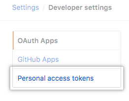

# Создание токена
1. Подтвердите свой адрес электронной почты , если он еще не подтвержден.

1. В правом верхнем углу любой страницы щелкните фотографию своего профиля, затем нажмите **Settings** (Настройки). 

    

1. На левой боковой панели нажмите **Developer settings** (Настройки разработчика). 

1. На левой боковой панели щелкните **Personal access tokens** (Личные токены доступа).

1. Щелкните **Generate new token** (Создать новый токен).

1. Дайте вашему токену описательное имя (любое, удобное Вам).

1. Выберите области или разрешения, которые вы хотите предоставить этому токену. Чтобы использовать свой токен для доступа к репозиториям из командной строки, выберите **repo**.

1. Щелкните **Generate token** (Создать токен).

1. Щелкните кнопку , чтобы скопировать токен в буфер обмена. По соображениям безопасности после того, как вы покинете страницу, вы больше не сможете увидеть токен. Сохраните его в удобном/надёжном месте, чтобы не потерять.

1. В дальнейшем, при запросе учетных данных (логина и пароля), вместо пароля указывайте этот токен.

`Предупреждение: относитесь к своим токенам как к паролям и держите их в секрете. При работе с API используйте токены в качестве переменных среды вместо того, чтобы жестко кодировать их в своих программах.`

<a href="https://docs.github.com/en/github/authenticating-to-github/keeping-your-account-and-data-secure/creating-a-personal-access-token">Оригинал</a>